<!-- /*Copyright 2025 HouHackathon-CQP

 Licensed under the Apache License, Version 2.0 (the "License");
 you may not use this file except in compliance with the License.
 You may obtain a copy of the License at

     http://www.apache.org/licenses/LICENSE-2.0

 Unless required by applicable law or agreed to in writing, software
 distributed under the License is distributed on an "AS IS" BASIS,
 WITHOUT WARRANTIES OR CONDITIONS OF ANY KIND, either express or implied.
 See the License for the specific language governing permissions and
 limitations under the License. */ -->

<div align="center">


# Nền Tảng Bản Đồ Xanh Thông Minh

> **"Công nghệ kết nối cộng đồng vì một Hà Nội trong lành"**

[](https://github.com/HouHackathon-CQP/GreenMap-Frontend)
[](https://github.com/HouHackathon-CQP/GreenMap-Mobile-App)
[](https://github.com/HouHackathon-CQP/GreenMap-Backend)
[](LICENSE)
[](https://github.com/HouHackathon-CQP)

**Language:** **[VI]** | [EN](README_EN.md)

---

### 🎯 Sứ Mệnh

**Minh bạch hóa** môi trường đô thị | **Định hướng** lối sống xanh | **Kết nối** sức mạnh cộng đồng

</div>

---

## 💡 Về Dự Án

**GreenMap Hanoi** không chỉ là một ứng dụng bản đồ - đây là hệ sinh thái công nghệ kết hợp AI, IoT và dữ liệu mở để giải quyết bài toán ô nhiễm môi trường tại Hà Nội.

### 🌍 Bối Cảnh & Vấn Đề

Hà Nội - thủ đô ngàn năm văn hiến đang đối mặt với thách thức lớn về chất lượng không khí và môi trường sống:

- 🏭 **Ô nhiễm không khí:** Chỉ số AQI thường xuyên ở mức "Nguy hại" với PM2.5 vượt chuẩn WHO 5-10 lần
- 🚗 **Giao thông ùn tắc:** Lượng phương tiện tăng 15-20%/năm, phát thải khí CO2 gia tăng
- 🌳 **Thiếu không gian xanh:** Tỷ lệ cây xanh/người thấp hơn nhiều so với các thành phố châu Á
- 📊 **Thiếu dữ liệu minh bạch:** Thông tin môi trường phân tán, khó tiếp cận với người dân

### ✨ Giải Pháp Của Chúng Tôi

GreenMap cung cấp một nền tảng tích hợp toàn diện với 3 trụ cột chính:

| 🔍 **Giám Sát Real-time** | 🌱 **Hạ Tầng Xanh** | 👥 **Cộng Đồng Tham Gia** |
|:---:|:---:|:---:|
| Theo dõi AQI, thời tiết, giao thông theo từng khu vực | Bản đồ công viên, trạm sạc EV, xe đạp, du lịch | Báo cáo điểm nóng, chia sẻ thông tin môi trường |

---

## 🏗️ Kiến Trúc Hệ Thống

### Thiết Kế Phân Tầng

GreenMap được xây dựng theo mô hình **Hybrid Architecture** kết hợp giữa xử lý tĩnh và luồng dữ liệu thời gian thực:

<div align="center">


</div>

### 🔑 Điểm Độc Đáo

#### 1️⃣ **Dual Storage Strategy**

- **PostgreSQL + PostGIS**: Lưu trữ dữ liệu tĩnh (users, locations, reports) với khả năng truy vấn địa lý mạnh mẽ
- **MongoDB via Orion-LD**: Xử lý luồng dữ liệu động (AQI, weather, traffic) theo chuẩn NGSI-LD quốc tế

#### 2️⃣ **NGSI-LD Context Broker**

Tích hợp **FIWARE Orion-LD** - chuẩn mực toàn cầu cho Smart Cities, cho phép:
- 🔌 Plug-and-play với IoT sensors
- 🌐 Interoperability với các hệ thống thông minh khác
- ⚡ Real-time data streaming
- 📡 Subscription-based notifications

#### 3️⃣ **Background Processing**

Workers tự động cập nhật dữ liệu:
- 🌫️ AQI Agent: Mỗi 30 phút
- 🌤️ Weather Agent: Mỗi 15 phút
- 🔄 Auto-sync với Orion-LD Broker

#### 4️⃣ **AI-Powered Insights**

Phân tích thông minh với Google Gemini và Groq:
- 🤖 **Multi-Provider AI**: Tự động chuyển đổi giữa Gemini và Groq khi cần
- 🌤️ **Weather & AQI Analysis**: Phân tích dữ liệu thời tiết 24h/7 ngày kết hợp chất lượng không khí
- 💡 **Actionable Recommendations**: Đưa ra lời khuyên, dự báo cho việc ra ngoài, vận động, mang theo vật dụng
- 📊 **Context-Aware**: Lưu trữ context phân tích để tham khảo lại sau
- 🇻🇳 **Vietnamese Language**: Phân tích hoàn toàn bằng tiếng Việt, dễ hiểu và hành động

---

## 📦 Cấu Trúc Dự Án

<div align="center">

### 🔗 4 Repository Chính

</div>

#### 🔧 Backend Services
> **[GreenMap-Backend](https://github.com/HouHackathon-CQP/GreenMap-Backend)** - Core API & Data Processing

<table>
<tr>
<td width="60%">

**Kiến Trúc:**
```
⚙️ FastAPI REST API Server
├─ PostgreSQL + PostGIS (Spatial data)
├─ MongoDB + Orion-LD (IoT/NGSI-LD)
├─ JWT Authentication & Authorization
└─ Background Workers (AQI/Weather sync)
```

**Chức Năng Chính:**
- 🔐 User management & JWT auth
- 📍 Location CRUD (parks, EV stations, bikes)
- 📢 Community report workflow
- 🌫️ Real-time AQI/Weather sync (15-30 min)
- 🔄 Orion-LD Context Broker integration
- 🤖 AI weather/AQI insights (Gemini + Groq)
- 📊 AI analysis history & context storage

</td>
<td width="40%">

**Tech Stack:**


**Status:** ✅ Production Ready

**API Endpoints:** 27+

**Auto-sync:** Every 15-30 min

**AI Providers:** Gemini & Groq

</td>
</tr>
</table>

---

#### 🎨 Frontend Applications
> **[GreenMap-Frontend](https://github.com/HouHackathon-CQP/GreenMap-Frontend)** - Admin Dashboard & Analytics

<table>
<tr>
<td width="60%">

**Kiến Trúc:**
```
💻 React 19 + TypeScript
├─ MapLibre GL JS (3D Interactive Maps)
├─ Recharts (Data Visualization)
├─ TailwindCSS + Tailwind Animate
└─ React Router v7 (Client-side routing)
```

**Chức Năng Chính:**
- 🗺️ 7-layer interactive map (AQI, Traffic, Parks, EV, etc.)
- 📊 Real-time KPI dashboard
- ✅ Report approval system
- 👥 User management (ADMIN/CITIZEN roles)
- 📈 Analytics & trends visualization

</td>
<td width="40%">

**Tech Stack:**


**Status:** ✅ Production Ready

**Map Layers:** 7

**Charts:** 5+ types

</td>
</tr>
</table>

---

#### 📱 Mobile Platform
> **[GreenMap-Mobile-App](https://github.com/HouHackathon-CQP/GreenMap-Mobile-App)** - Citizen Mobile App

<table>
<tr>
<td width="60%">

**Kiến Trúc:**
```
📲 Android Native App
├─ Kotlin + Jetpack Compose
├─ MVI Architecture Pattern
├─ MapLibre SDK (Offline maps)
├─ Hilt (Dependency Injection)
└─ Room + DataStore (Local storage)
```

**Chức Năng Chính:**
- 🌫️ Real-time AQI by GPS location
- 🌤️ Weather forecast 24h
- 🚗 Traffic density monitoring
- 🌳 Green infrastructure map (parks, EV, bikes)
- 📢 Community pollution reporting

</td>
<td width="40%">

**Tech Stack:**


**Status:** 🚧 Active Development

**Min SDK:** Android 7.0 (API 24)

**Features:** 10+

</td>
</tr>
</table>

---

#### 📊 Data Repository
> **[GreenMap-Data](https://github.com/HouHackathon-CQP/GreenMap-Data)** - Open Dataset & Processing

<table>
<tr>
<td width="60%">

**Kiến Trúc:**
```
🗄️ Data Collection & Processing
├─ Jupyter Notebooks (Analysis)
├─ GeoJSON Datasets (500+ POIs)
├─ SUMO Traffic Simulation
└─ Python Scripts (ETL pipelines)
```

**Datasets:**
- 🏞️ Parks & green spaces (200+)
- ⚡ EV charging stations (100+)
- 🚴 Bike rental points (50+)
- 🏛️ Tourist attractions (150+)
- 🚗 Traffic simulation data (SUMO)
- 📊 Historical AQI/Weather data

</td>
<td width="40%">

**Tech Stack:**


**Status:** ✅ Open Data

**Total POIs:** 500+

**Format:** GeoJSON, JSON

</td>
</tr>
</table>

---

## ⚡ Tính Năng Chính

<div align="center">

### 🎯 Cho Người Dùng Cuối (Mobile App)

</div>

| Tính Năng     | Mô Tả     |
|:--------------|:----------|
| 🌫️ **AQI Real-time** | Theo dõi chất lượng không khí (PM2.5, PM10, NO2, O3) theo vị trí GPS |
| 🌤️ **Dự Báo Thời Tiết** | Nhiệt độ, độ ẩm, lượng mưa, gió - cập nhật 15 phút/lần |
| 🤖 **AI Insights** | Phân tích thời tiết & AQI bằng AI (Gemini/Groq), đưa ra lời khuyên cá nhân hóa |
| 🚗 **Traffic Monitor** | Mật độ giao thông real-time từ SUMO simulation |
| ⚡ **EV Charging** | Tìm trạm sạc xe điện gần nhất + trạng thái available |
| 🚴 **Bike Sharing** | Vị trí điểm thuê xe đạp công cộng |
| 🏞️ **Điểm Xanh** | Công viên, khu du lịch, điểm check-in xanh |
| 📢 **Community Report** | Báo cáo điểm ô nhiễm + upload ảnh hiện trường |
| 📰 **Tin Tức Xanh** | RSS feed từ báo Hà Nội Mới về môi trường |

<div align="center">

### 💼 Cho Quản Trị Viên (Web Dashboard)

</div>

| Tính Năng | Mô Tả |
|:----------|:------|
| 📊 **KPI Dashboard** | Overview tổng quan: sensors, users, reports, alerts |
| 🗺️ **Multi-layer Map** | 7 lớp: AQI, Weather, Traffic, EV, Bike, Park, Report |
| 📈 **Analytics** | Biểu đồ AQI theo quận, so sánh trends, heatmap |
| 🤖 **AI Analytics** | Xem lịch sử phân tích AI, context data, và insights |
| ✅ **Report Management** | Duyệt/từ chối báo cáo từ cộng đồng |
| 👥 **User Management** | CRUD users, phân quyền ADMIN/CITIZEN |
| 🌳 **Green Infrastructure** | CRUD công viên, trạm sạc EV, điểm thuê xe đạp, du lịch |

---

## 📊 Dữ Liệu & Data Pipeline

### 🔌 Nguồn Dữ Liệu

```mermaid
graph LR
    A[🌍 OpenStreetMap] -->|GeoJSON| E[Data Hub]
    B[🌫️ OpenAQ] -->|Air Quality| E
    C[🌤️ Weather API] -->|Meteorology| E
    D[🚗 SUMO] -->|Traffic Sim| E
    F[📢 RSS Feed] -->|News| E
    G[👥 Users] -->|Reports| E
    
    E --> H{Processing}
    H -->|Static| I[(PostgreSQL)]
    H -->|Dynamic| J[(Orion-LD)]
    
    style A fill:#e74c3c
    style B fill:#e67e22
    style C fill:#f39c12
    style D fill:#3498db
    style F fill:#9b59b6
    style G fill:#1abc9c
    style E fill:#34495e,color:#fff
    style H fill:#2c3e50,color:#fff
    style I fill:#27ae60,color:#fff
    style J fill:#16a085,color:#fff
```



<table>
<tr>
<th width="20%">Nguồn</th>
<th width="30%">Loại Dữ Liệu</th>
<th width="25%">Phương Thức</th>
<th width="25%">Tần Suất</th>
</tr>

<tr>
<td><b>OpenStreetMap</b></td>
<td>🏞️ Parks<br>⚡ EV Chargers<br>🚴 Bike Rentals<br>🏛️ Tourist Sites</td>
<td>Overpass API<br/>+ Jupyter Processing</td>
<td>One-time<br/>(Manual refresh)</td>
</tr>

<tr>
<td><b>OpenAQ</b></td>
<td>🌫️ PM2.5, PM10<br>💨 NO2, O3<br>☠️ CO, SO2</td>
<td>REST API<br/>Auto-sync</td>
<td>🔄 Every 30 min</td>
</tr>

<tr>
<td><b>Weather API</b></td>
<td>🌡️ Temperature<br>💧 Humidity<br>☁️ Conditions<br>🌧️ Forecast 24h</td>
<td>REST API<br/>Background Worker</td>
<td>🔄 Every 15 min</td>
</tr>

<tr>
<td><b>SUMO</b></td>
<td>🚗 Traffic Flow<br>🚦 Congestion<br>📉 Vehicle Count</td>
<td>Simulation Output<br/>JSON Export</td>
<td>Simulation-based</td>
</tr>

<tr>
<td><b>RSS News</b></td>
<td>📰 Environmental News<br/>Hà Nội Mới</td>
<td>RSS Parser</td>
<td>🔄 Hourly</td>
</tr>

<tr>
<td><b>Community</b></td>
<td>📢 Pollution Reports<br>📸 Photos<br>📍 GPS Location</td>
<td>Mobile/Web App<br/>Upload</td>
<td>Real-time</td>
</tr>

</table>

### ⚙️ Data Processing Pipeline

```
🔽 COLLECT
  │
  ├─ OSM Overpass Query (amenity=charging_station, leisure=park...)
  ├─ OpenAQ API Call (GET /v2/latest)
  ├─ Weather API Poll
  └─ User Uploads (multipart/form-data)
  │
  ↓
🧹 CLEAN & VALIDATE
  │
  ├─ GeoJSON schema validation
  ├─ Coordinate bounds check (Hanoi bbox)
  ├─ Remove duplicates
  └─ Data type conversion
  │
  ↓
🔄 TRANSFORM
  │
  ├─ Convert to NGSI-LD entities (for dynamic data)
  ├─ Add timestamps & metadata
  ├─ Generate UUIDs
  └─ Calculate derived fields (AQI category)
  │
  ↓
💾 STORE
  │
  ├──→ PostgreSQL (static: users, locations, historical)
  └──→ MongoDB via Orion-LD (dynamic: sensors, real-time)
  │
  ↓
📡 SERVE
  │
  ├─ REST API (GET /api/locations, /api/aqi)
  ├─ NGSI-LD API (GET /ngsi-ld/v1/entities)
  └─ GeoJSON Endpoints (/geojson/parks)
  ↓
🔌 API Layer (FastAPI)
  ├─ REST API (CRUD operations)
  └─ NGSI-LD API (Real-time queries)
  ↓
🖥️ Visualization
  ├─ Admin Portal (React + MapLibre)
  └─ Mobile App (Kotlin + Compose)
```

### 📋 Chi tiết Quy trình:
1. **Thu thập**: GeoJSON từ OSM qua Overpass API, AQI từ OpenAQ API (auto-refresh mỗi 30 phút), Weather từ Weather API (auto-refresh mỗi 15 phút)
2. **Xử lý**: Jupyter Notebook (`data_collection.ipynb`), Python scripts (`merge_json.py`, `split_json.py`), Validation (geometry checks, attribute normalization)
3. **Lưu trữ**: Static data → PostgreSQL/PostGIS, Real-time IoT → Orion-LD → MongoDB, Files → `static/` folder
4. **Đồng bộ**: Background workers (`aqi_agent.py`, `weather_agent.py`), Sync script (`sync_to_orion.py`), Init scripts (`init_db.py`, `seed_sensor.py`)
5. **Truy xuất**: REST API (JSON response với Pydantic schemas), NGSI-LD queries (với header `Accept: application/ld+json`), GeoJSON endpoints cho bản đồ

---

## 🛠️ Tech Stack Chi Tiết

<details>
<summary><b>🔧 Backend Technologies</b></summary>

### Core Framework
```python
FastAPI 0.104+        # Modern async web framework
Python 3.10+          # Type hints, async/await
SQLAlchemy 2.0        # ORM with async support
Pydantic 2.0          # Data validation
```

### Databases
```
PostgreSQL 15         # Primary relational DB
PostGIS 3.3           # Spatial extensions
MongoDB 5.0           # Document store for NGSI-LD
```

### FIWARE Integration
```
Orion-LD 1.6.1        # Context Broker (NGSI-LD)
Smart Data Models     # Standard entity schemas
```

### AI & Machine Learning
```python
Google Gemini API     # AI analysis (primary)
Groq API              # AI analysis (fallback)
httpx                 # Async API calls
```

### Libraries
```python
geoalchemy2           # PostGIS integration
shapely               # Geometric operations
httpx                 # Async HTTP client
python-jose[cryptography]  # JWT tokens
bcrypt                # Password hashing
```

</details>

<details>
<summary><b>🎨 Frontend Technologies</b></summary>

### Core Framework
```javascript
React 19              // Latest React features
TypeScript 5.3        // Type safety
Vite 7.2              // Lightning-fast build tool
```

### UI & Styling
```css
TailwindCSS 3.4       /* Utility-first CSS */
Lucide React          /* Icon library */
Tailwind Animate      /* Animation utilities */
```

### Mapping & Visualization
```javascript
MapLibre GL JS 5.13   // 3D interactive maps
Recharts 3.4          // Charting library
Turf.js 7.3           // Geospatial analysis
```

### Routing & State
```javascript
React Router v7       // Client-side routing
React Context API     // State management
```

</details>

<details>
<summary><b>📱 Mobile Technologies</b></summary>

### Core
```kotlin
Kotlin 1.9+                    // Modern Android dev
Jetpack Compose BOM 2024      // Declarative UI
Material 3                     // Design system
```

### Architecture
```kotlin
MVI Pattern                    // Unidirectional data flow
Hilt                           // Dependency injection
Coroutines + Flow              // Async programming
```

### Libraries
```kotlin
Retrofit 2.9                   // HTTP client
Room Database                  // Local persistence
Coil                           // Image loading
MapLibre SDK                   // Map rendering
Navigation Compose 3           // Navigation
DataStore                      // Key-value storage
Lottie                         // Animations
```

</details>

<details>
<summary><b>📊 Data & DevOps</b></summary>

### Data Processing
```python
Jupyter Notebook      # Interactive analysis
Pandas + GeoPandas    # Data manipulation
Matplotlib + Seaborn  # Visualization
```

### Infrastructure
```yaml
Docker 20+            # Containerization
Docker Compose        # Multi-container orchestration
Uvicorn (ASGI)        # Production server
```

### CI/CD & Automation
```yaml
GitHub Actions        # Automated workflows
Docker Hub            # Container registry
Railway/Vercel        # Deployment platforms
Git Cliff             # Changelog automation
```

### External APIs
```
Overpass API          # OpenStreetMap queries
OpenAQ API            # Air quality data
Weather API           # Meteorological data
SUMO                  # Traffic simulation
```

</details>

---

## 🔄 CI/CD & Automation

GreenMap sử dụng **GitHub Actions** để tự động hóa toàn bộ quy trình phát triển, kiểm thử và triển khai.

### 🎯 Workflow Tự Động

```mermaid
graph TB
    A["👨‍💻 Developer<br/>Push to main"] --> B["⚙️ Setup Job<br/>GitHub Runner"]
    
    B --> C["📥 Checkout Code<br/>from main branch"]
    
    C --> D{"🔧 Build Action<br/>appleboy/ssh-action"}
    
    D --> E["🐳 Deploy Docker<br/>on Server via SSH"]
    
    E --> F{"✅ Deployment<br/>Success?"}
    
    F -->|"✅ Success"| G["📢 Discord Notification<br/>✅ Deploy thành công!"]
    F -->|"❌ Failed"| H["📢 Discord Notification<br/>❌ Deploy thất bại!"]
    
    G --> I["🧹 Post-Checkout<br/>Cleanup"]
    H --> I
    
    I --> J["✔️ Complete Job"]
    
    style A fill:#3498db,color:#fff,stroke:#2980b9,stroke-width:3px
    style B fill:#95a5a6,color:#fff,stroke:#7f8c8d,stroke-width:2px
    style C fill:#3498db,color:#fff,stroke:#2980b9,stroke-width:2px
    style D fill:#9b59b6,color:#fff,stroke:#8e44ad,stroke-width:2px
    style E fill:#e67e22,color:#fff,stroke:#d35400,stroke-width:3px
    style F fill:#f39c12,color:#fff,stroke:#f1c40f,stroke-width:3px
    style G fill:#27ae60,color:#fff,stroke:#229954,stroke-width:3px
    style H fill:#e74c3c,color:#fff,stroke:#c0392b,stroke-width:3px
    style I fill:#95a5a6,color:#fff,stroke:#7f8c8d,stroke-width:2px
    style J fill:#2ecc71,color:#fff,stroke:#27ae60,stroke-width:3px
```

<div align="center">



</div>

### 📋 Workflow Chi Tiết

#### 🎨 **Frontend CI/CD** (GreenMap-Frontend)

**Trigger Events:**
- ✅ Push to `main` branch
- ✅ Manual workflow dispatch

**Pipeline Steps:**

```yaml
name: Deploy Frontend to Server

on:
  push:
    branches: [main]

jobs:
  deploy:
    runs-on: ubuntu-latest
    steps:
      - name: 📥 Checkout Code
        uses: actions/checkout@v4
        
      - name: 🚀 Deploy via SSH
        uses: appleboy/ssh-action@v1.0.3
        with:
          host: ${{ secrets.SSH_HOST }}
          username: ${{ secrets.SSH_USER }}
          key: ${{ secrets.SSH_PRIVATE_KEY }}
          port: ${{ secrets.SSH_PORT }}
          script: |
            echo "===== 🛠 Start Deploy GreenMap-Frontend ====="
            cd /home/GreenMap-Frontend
            
            echo "📥 Pull code mới nhất từ GitHub"
            git reset --hard
            git checkout main
            git pull origin main
            
            echo "🐳 Dừng Docker cũ"
            docker compose down || true
            
            echo "🐳 Build Docker image mới"
            docker compose build --no-cache
            
            echo "🚀 Khởi động lại dịch vụ"
            docker compose up -d
            
            echo "===== ✅ Deploy thành công ====="
            
      - name: ✅ Notify Success
        if: success()
        uses: sarisia/actions-status-discord@v1
        with:
          webhook: ${{ secrets.DISCORD_WEBHOOK }}
          title: "✅ Frontend Deploy thành công!"
          description: |
            **Commit:** ${{ github.event.head_commit.message }}
            **Author:** ${{ github.actor }}
            **Files Changed:** ${{ github.event.head_commit.modified }}
          
      - name: ❌ Notify Failure
        if: failure()
        uses: sarisia/actions-status-discord@v1
        with:
          webhook: ${{ secrets.DISCORD_WEBHOOK }}
          title: "❌ Frontend Deploy thất bại!"
          description: "Check workflow logs for details"
```

**Real Deployment Output:**
```bash
===== 🛠 Start Deploy GreenMap-Frontend =====
📥 Pull code mới nhất từ GitHub
HEAD is now at 880ed84
Already on 'main'
Updating dff29af..880ed84
Fast-forward
 35 files changed, 3204 insertions(+), 1068 deletions(-)
 
🐳 Dừng Docker cũ
Container greenmap-frontend-frontend-1  Stopped
Container greenmap-frontend-frontend-1  Removed

🐳 Build Docker image mới
#4 [frontend builder 4/7] RUN npm ci
added 470 packages, and audited 471 packages in 21s

#12 [frontend builder 7/7] RUN npm run build
vite v7.2.2 building for production...
✓ 2354 modules transformed.
dist/assets/index.js   2,010.45 kB │ gzip: 569.77 kB
✓ built in 31.20s

🚀 Khởi động lại dịch vụ
Container greenmap-frontend-frontend-1  Started

===== ✅ Deploy thành công =====
```

**Automated Tasks:**
- ✅ SSH deployment to server
- ✅ Git reset & pull latest code
- ✅ Docker Compose down/build/up
- ✅ No-cache build for fresh deployment
- ✅ Discord notifications with commit details

---

### 🔔 Notifications & Monitoring

**Discord Integration:**
```yaml
- name: 📢 Notify Discord
  if: always()
  uses: sarisia/actions-status-discord@v1
  with:
    webhook: ${{ secrets.DISCORD_WEBHOOK }}
    title: ${{ job.status == 'success' && '✅ Deploy thành công!' || '❌ Deploy thất bại!' }}
    description: |
      **Repository:** ${{ github.repository }}
      **Branch:** ${{ github.ref_name }}
      **Commit:** ${{ github.sha }}
      **Author:** ${{ github.actor }}
    color: ${{ job.status == 'success' && '0x00ff00' || '0xff0000' }}
    username: "GreenMap CI/CD Bot"
```

**Notification Types:**
- ✅ Deployment successes (green embed)
- ❌ Deployment failures (red embed)
- 📊 Build status with commit info
- 👤 Author and branch details

---

### 📈 Automated Changelog

Sử dụng **Git Cliff** để tự động tạo CHANGELOG:

```yaml
name: Generate Changelog

on:
  push:
    tags:
      - 'v*'

jobs:
  changelog:
    runs-on: ubuntu-latest
    steps:
      - name: 📝 Generate Changelog
        run: git cliff -o CHANGELOG.md
      - name: 📤 Commit Changelog
      - name: 🚀 Create GitHub Release
```

**Format:**
```markdown
## [1.2.0] - 2025-12-10

### Features
- feat: Add AI weather insights with Gemini API
- feat: Implement Groq fallback for AI analysis

### Bug Fixes
- fix: PostgreSQL connection timeout issue
- fix: Mobile app crash on map rotation

### Documentation
- docs: Update installation guide for beginners
```

---

### 🔐 Security Scanning

**Dependabot:**
```yaml
version: 2
updates:
  - package-ecosystem: "pip"
    directory: "/GreenMap-Backend"
    schedule:
      interval: "weekly"
      
  - package-ecosystem: "npm"
    directory: "/GreenMap-Frontend"
    schedule:
      interval: "daily"
```

**CodeQL Analysis:**
```yaml
name: Security Scan

on:
  push:
  schedule:
    - cron: '0 0 * * 1'  # Weekly

jobs:
  analyze:
    steps:
      - name: 🔍 Initialize CodeQL
      - name: 🔍 Autobuild
      - name: 🔍 Perform Analysis
```

---

### 📊 Thống Kê Workflow

**Môi Trường Triển Khai:**
- **Runner:** GitHub-hosted (Ubuntu 24.04 LTS)
- **Phiên Bản Runner:** 2.329.0
- **Node.js:** v22-alpine (Docker)
- **Docker Engine:** Mới nhất với BuildKit

**Thời Gian Deploy Trung Bình:**
- 🔧 Backend: Deploy thủ công (~5-10 phút)
- 🎨 Frontend SSH Deploy: ~2-3 phút tổng cộng (tự động)
  - Checkout code: ~5 giây
  - Build Docker container: ~1 phút
  - Kết nối SSH & deploy: ~1 phút
  - Thao tác Docker Compose: ~45 giây
  - npm ci (cài đặt): ~21 giây
  - Vite build: ~31 giây
  - Tổng Docker build: ~62 giây
- 📱 Mobile: Build thủ công (~15-20 phút)
- 📊 Data: Cập nhật thủ công (~5 phút)

**Chi Tiết Các Bước Deploy (Ví Dụ Frontend):**
```
1. Khởi tạo Job                  ~10s
2. Checkout Code                 ~5s
3. Build appleboy/ssh-action     ~3s
4. Kết nối SSH tới Server        ~2s
5. Git Pull                      ~8s
6. Docker Compose Down           ~3s
7. Docker Build (--no-cache)     ~62s
   ├─ npm ci                     21s
   ├─ Vite build                 31s
   └─ Export image               5s
8. Docker Compose Up             ~5s
9. Thông báo Discord             ~2s
10. Dọn dẹp sau Checkout         ~1s
─────────────────────────────────────
Tổng: ~1m 40s
```

**Chỉ Số Build (Frontend):**
- **Modules Đã Chuyển Đổi:** 2,354
- **Kích Thước Bundle:** 
  - index.js: 2,010 kB (569 kB gzipped)
  - index.css: 135 kB (20 kB gzipped)
- **Dependencies:** 470 packages
- **Docker Image:** ~150 MB

**Tỷ Lệ Thành Công:** 98%+ ✅

---

## 🌐 API Endpoints

Chúng tôi cung cấp các API công khai sau:

### 🌍 Dữ Liệu Môi Trường

**Chất lượng không khí (AQI):**
```
https://backend.myhou.io.vn/aqi/hanoi?limit=100
```

**Thời tiết:**
```
https://backend.myhou.io.vn/weather/hanoi?limit=100
```

### 📍 Dữ Liệu Địa Điểm

**Trạm sạc điện:**
```
https://backend.myhou.io.vn/locations?location_type=CHARGING_STATION&limit=100&skip=0&options=keyValues&raw=false
```

**Công viên:**
```
https://backend.myhou.io.vn/locations?location_type=PUBLIC_PARK&limit=100&skip=0&options=keyValues&raw=false
```

**Điểm thuê xe đạp:**
```
https://backend.myhou.io.vn/locations?location_type=BICYCLE_RENTAL&limit=100&skip=0&options=keyValues&raw=false
```

**Điểm du lịch:**
```
https://backend.myhou.io.vn/locations?location_type=TOURIST_ATTRACTION&limit=100&skip=0&options=keyValues&raw=false
```

### 📝 Tham Số Query

| Tham số | Mô tả | Giá trị mặc định |
|:--------|:------|:-----------------|
| `limit` | Số lượng kết quả tối đa | 100 |
| `skip` | Bỏ qua n kết quả đầu | 0 |
| `options` | Định dạng dữ liệu | keyValues |
| `raw` | Trả về dữ liệu thô | false |
| `location_type` | Loại địa điểm | - |

**Loại địa điểm có sẵn:**
- `CHARGING_STATION` - Trạm sạc xe điện
- `PUBLIC_PARK` - Công viên công cộng
- `BICYCLE_RENTAL` - Điểm thuê xe đạp
- `TOURIST_ATTRACTION` - Điểm tham quan du lịch

---

## 🚀 Bắt Đầu Nhanh

### 📋 Yêu Cầu Hệ Thống
- **Docker Desktop** (bắt buộc cho backend)
- **Node.js** 18+ (cho frontend)
- **Python** 3.10+ (cho backend và data processing)
- **Android Studio** Hedgehog+ (cho mobile)
- **Git**

### 💿 Cài Đặt Toàn Hệ Thống

#### 1️⃣ Clone Repositories
```bash
# Clone tất cả repos
git clone https://github.com/HouHackathon-CQP/GreenMap-Backend.git
git clone https://github.com/HouHackathon-CQP/GreenMap-Frontend.git
git clone https://github.com/HouHackathon-CQP/GreenMap-Data.git
git clone https://github.com/HouHackathon-CQP/GreenMap-Mobile-App.git
```

#### 2️⃣ Backend Setup (FastAPI + Orion-LD)
```bash
cd GreenMap-Backend

# Tạo virtual environment
python -m venv .venv
.\.venv\Scripts\activate  # Windows
# source .venv/bin/activate  # macOS/Linux

# Cài đặt dependencies
pip install -r requirements.txt

# Tạo file .env
copy env.example .env
# Chỉnh sửa .env với thông tin của bạn

# Khởi động Docker containers (PostgreSQL + MongoDB + Orion-LD)
docker-compose up -d

# Đợi 10-15 giây cho containers khởi động
timeout /t 15  # Windows
# sleep 15  # macOS/Linux

# Khởi tạo database và dữ liệu mẫu
python setup_project.py

# Chạy backend
python main.py
# Server chạy tại: http://localhost:8000
# API docs: http://localhost:8000/docs
# Orion-LD: http://localhost:1026
```

**Ports sử dụng:**
- `8000`: FastAPI Backend
- `5432`: PostgreSQL
- `27017`: MongoDB
- `1026`: Orion-LD Context Broker

#### 3️⃣ Frontend Setup (React + Vite)
```bash
cd GreenMap-Frontend

# Cài đặt dependencies
npm install

# Chạy dev server
npm run dev
# Ứng dụng chạy tại: http://localhost:5173
```

**Tài khoản admin mặc định:**
- Email: `admin@greenmap.hanoi`
- Password: `123456`

#### 4️⃣ Data Processing (Python Notebooks)
```bash
cd GreenMap-Data

# Tạo virtual environment
python -m venv .venv
.\.venv\Scripts\activate

# Cài đặt dependencies
pip install jupyter geopandas pandas shapely

# Khởi động Jupyter
jupyter notebook
# Mở file: data_collection.ipynb
```

#### 5️⃣ Mobile App Setup (Android)
```bash
cd GreenMap-Mobile-App

# Tạo local.properties
echo "sdk.dir=C:\\Users\\YourName\\AppData\\Local\\Android\\sdk" > local.properties
echo "MAPTILER_API_KEY=your_maptiler_key_here" >> local.properties
echo "API_BASE_URL=http://10.0.2.2:8000/" >> local.properties

# Build với Android Studio hoặc CLI
./gradlew assembleDebug
./gradlew installDebug
```

---

## 🤝 Đóng Góp

Chúng tôi hoan nghênh mọi đóng góp từ cộng đồng!

### 📝 Cách Đóng Góp
1. **Fork** repository bạn muốn đóng góp
2. Tạo **feature branch**: `git checkout -b feature/TinhNangMoi`
3. **Commit** thay đổi: `git commit -m 'feat: Thêm tính năng XYZ'`
4. **Push** lên branch: `git push origin feature/TinhNangMoi`
5. Tạo **Pull Request**

### 💬 Quy Tắc Commit
Sử dụng [Conventional Commits](https://www.conventionalcommits.org/):
- `feat:` - Tính năng mới
- `fix:` - Sửa lỗi
- `docs:` - Thay đổi documentation
- `style:` - Formatting, missing semi colons, etc
- `refactor:` - Code refactoring
- `test:` - Thêm tests
- `chore:` - Maintain

---

## 📄 Giấy Phép

Dự án này được cấp phép theo **Apache License 2.0** - xem file [LICENSE](https://github.com/HouHackathon-CQP/GreenMap-Backend/blob/main/LICENSE) để biết chi tiết.

```
Copyright 2025 HouHackathon-CQP

Licensed under the Apache License, Version 2.0 (the "License");
you may not use this file except in compliance with the License.
You may obtain a copy of the License at

    http://www.apache.org/licenses/LICENSE-2.0

Unless required by applicable law or agreed to in writing, software
distributed under the License is distributed on an "AS IS" BASIS,
WITHOUT WARRANTIES OR CONDITIONS OF ANY KIND, either express or implied.
See the License for the specific language governing permissions and
limitations under the License.
```

---

## 🔗 Liên Kết Quan Trọng

- **🐛 Issues**: [GitHub Issues](https://github.com/HouHackathon-CQP/GreenMap-Backend/issues)
- **💬 Discussions**: [GitHub Discussions](https://github.com/HouHackathon-CQP/GreenMap-Backend/discussions)
- **📖 API Docs**: `http://localhost:8000/docs` (khi chạy backend)

### 📦 Repositories
- [GreenMap-Backend](https://github.com/HouHackathon-CQP/GreenMap-Backend)
- [GreenMap-Frontend](https://github.com/HouHackathon-CQP/GreenMap-Frontend)
- [GreenMap-Data](https://github.com/HouHackathon-CQP/GreenMap-Data)
- [GreenMap-Mobile-App](https://github.com/HouHackathon-CQP/GreenMap-Mobile-App)

---

## 📧 Liên Hệ

**Nhóm Phát Triển:** HouHackathon-CQP

**Địa chỉ:**
- 96 Định Công, Hà Nội, Việt Nam
- Nhà B101, phố Nguyễn Hiền, phường Bạch Mai, TP Hà Nội
- Trường Đại học Mở Hà Nội - Khoa Công nghệ thông tin (FITHOU)

**Email:** thocodeanhquan@gmail.com

**GitHub Organization:** [@HouHackathon-CQP](https://github.com/HouHackathon-CQP)

---

## 🙏 Ghi Nhận

Dự án này sử dụng dữ liệu và công nghệ từ:

- **OpenStreetMap** contributors - Dữ liệu bản đồ mở
- **FIWARE Foundation** - Orion-LD Context Broker
- **OpenAQ** - Dữ liệu chất lượng không khí
- **Smart Data Models** - NGSI-LD context và schemas
- **MapLibre** - Open-source mapping library
- **SUMO** (Simulation of Urban MObility) - Traffic simulation
- **Báo Hà Nội Mới** - RSS news feed
- **Google Gemini** - AI analysis và insights
- **Groq** - AI analysis và insights (fallback)


---

## 👥 Đội ngũ phát triển

Chúng tôi là những sinh viên công nghệ, code bằng đam mê và mang trong mình tình yêu lớn với Hà Nội.

<table>
  <tr>
    <td align="center">
      <a href="https://github.com/kedokato-dev">
        <br>
        <sub><b>Trần Anh Quân</b></sub>
      </a><br>
      <small><i>Team Lead</i></small>
    </td>
    <td align="center">
      <a href="https://github.com/blueMonkey23">
        <br>
        <sub><b>Trần Trọng Chiến</b></sub>
      </a><br>
      <small><i>Backend Specialist & System Architect</i></small>
    </td>
    <td align="center">
      <a href="https://github.com/ourstorycomic">
        <br>
        <sub><b>Nguyễn Hà Phương</b></sub>
      </a><br>
      <small><i>Frontend Developer & Data Viz</i></small>
    </td>
  </tr>
</table>

---

## 💌 Lời mời hợp tác

GreenMap là một dự án **Mã nguồn mở (Open Source)** và hướng tới **Dữ liệu mở (Open Data)**. Chúng tôi không thể làm điều này một mình.

Nếu bạn là:
* **Mobile Dev:** Hãy giúp chúng tôi tối ưu hiệu năng App Kotlin, làm cho nó mượt mà hơn trên các dòng máy phổ thông.
* **Data Scientist:** Model AI của chúng tôi cần thông minh hơn. Nếu bạn có ý tưởng về thuật toán dự báo mới, hãy Pull Request!
* **Cơ quan/Tổ chức:** Nếu bạn có dữ liệu quan trắc (Sở TNMT, WHO, AirVisual...), hãy chia sẻ API để chúng tôi tích hợp.

Đừng ngần ngại mở một **Issue** để góp ý hoặc gửi **Pull Request**. Mỗi dòng code của bạn đều góp phần làm không khí Hà Nội trong lành hơn.

*Vui lòng đọc kỹ file `CONTRIBUTING.md` trong từng repository con để bắt đầu nhé!*

---

<div align="center">

### Code for Hanoi. Code for Life. 🌿

*© 2025 GreenMap Hanoi Project. Made with ❤️ and lots of ☕ in Hanoi.*

**GreenMap** - Hệ Sinh Thái Bản Đồ Xanh Thông Minh  
Phát triển bởi **Nhóm HouHackathon-CQP**  
Trường Đại học Mở Hà Nội (HOU)

🌱 *Vì một Hà Nội xanh hơn, sạch hơn, thông minh hơn* 🌱

</div>
