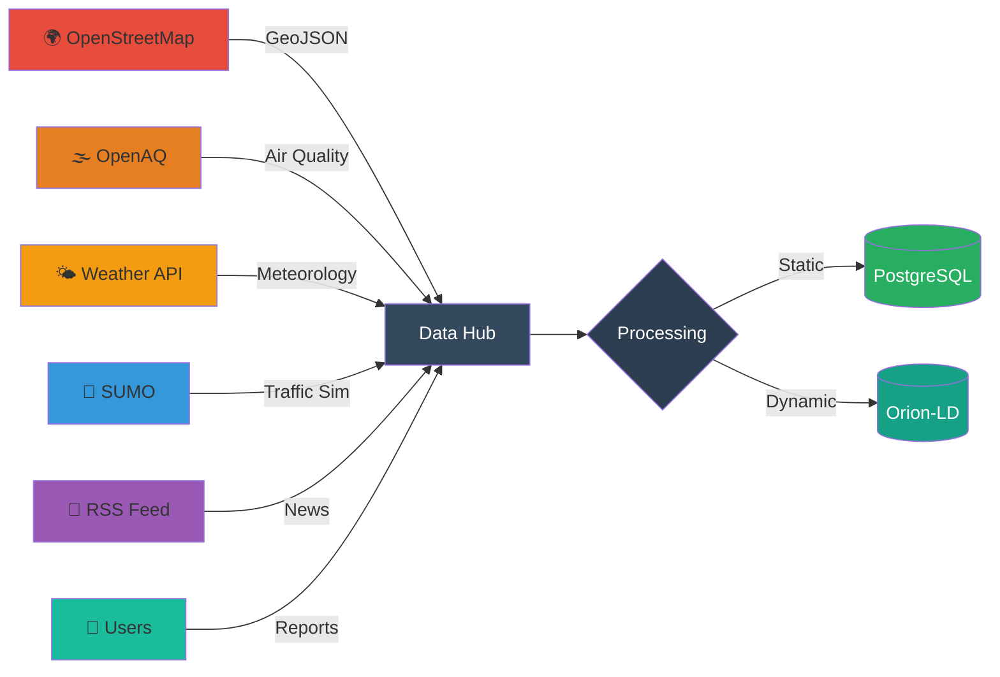

<!-- /*Copyright 2025 HouHackathon-CQP

 Licensed under the Apache License, Version 2.0 (the "License");
 you may not use this file except in compliance with the License.
 You may obtain a copy of the License at

     http://www.apache.org/licenses/LICENSE-2.0

 Unless required by applicable law or agreed to in writing, software
 distributed under the License is distributed on an "AS IS" BASIS,
 WITHOUT WARRANTIES OR CONDITIONS OF ANY KIND, either express or implied.
 See the License for the specific language governing permissions and
 limitations under the License. */ -->

<div align="center">


# Smart Green Map Platform

> **"Technology connecting communities for a cleaner Hanoi"**

[](https://github.com/HouHackathon-CQP/GreenMap-Frontend)
[](https://github.com/HouHackathon-CQP/GreenMap-Mobile-App)
[](https://github.com/HouHackathon-CQP/GreenMap-Backend)
[](LICENSE)
[](https://github.com/HouHackathon-CQP)

**Language:** [VI](README.md) | **[EN]**

---

### 🎯 Mission

**Transparency** in urban environment | **Direction** for green living | **Connection** of community power

</div>

---

## 💡 About The Project

**GreenMap Hanoi** is not just a mapping application - it's a technology ecosystem combining AI, IoT, and open data to solve environmental pollution challenges in Hanoi.

### 🌍 Background & Problem

Hanoi - the thousand-year-old capital is facing significant challenges in air quality and living environment:

- 🏭 **Air pollution:** AQI frequently at "Hazardous" levels with PM2.5 exceeding WHO standards by 5-10 times
- 🚗 **Traffic congestion:** Vehicle numbers increasing 15-20%/year, rising CO2 emissions
- 🌳 **Lack of green spaces:** Trees-per-capita ratio much lower than other Asian cities
- 📊 **Lack of transparent data:** Environmental information scattered, difficult for citizens to access

### ✨ Our Solution

GreenMap provides a comprehensive integrated platform with 3 main pillars:

| 🔍 **Real-time Monitoring** | 🌱 **Green Infrastructure** | 👥 **Community Participation** |
|:---:|:---:|:---:|
| Track AQI, weather, traffic by area | Map of parks, EV stations, bikes, tourism | Report hotspots, share environmental info |

---

## 🏗️ System Architecture

### Hybrid Microservices Design

GreenMap is built on a **Hybrid Architecture** model combining static processing and real-time data streaming:

<div align="center">


</div>

### 🔑 Unique Features

#### 1️⃣ **Dual Storage Strategy**

- **PostgreSQL + PostGIS**: Store static data (users, locations, reports) with powerful geospatial queries
- **MongoDB via Orion-LD**: Handle dynamic data streams (AQI, weather, traffic) following international NGSI-LD standard

#### 2️⃣ **NGSI-LD Context Broker**

Integration with **FIWARE Orion-LD** - global standard for Smart Cities, enabling:
- 🔌 Plug-and-play with IoT sensors
- 🌐 Interoperability with other smart systems
- ⚡ Real-time data streaming
- 📡 Subscription-based notifications

#### 3️⃣ **Background Processing**

Workers automatically update data:
- 🌫️ AQI Agent: Every 30 minutes
- 🌤️ Weather Agent: Every 15 minutes
- 🔄 Auto-sync with Orion-LD Broker

#### 4️⃣ **AI-Powered Insights**

Smart analysis with Google Gemini and Groq:
- 🤖 **Multi-Provider AI**: Automatic fallback between Gemini and Groq
- 🌤️ **Weather & AQI Analysis**: Analyze 24h/7-day weather data combined with air quality
- 💡 **Actionable Recommendations**: Suggest outdoor schedules, exercise, items to bring
- 📊 **Context-Aware**: Store analysis context for future reference
- 🇻🇳 **Vietnamese Language**: Full analysis in Vietnamese, easy to understand and act on

---

## 📦 Project Structure

<div align="center">

### 🔗 4 Main Repositories

</div>

#### 🔧 Backend Services
> **[GreenMap-Backend](https://github.com/HouHackathon-CQP/GreenMap-Backend)** - Core API & Data Processing

<table>
<tr>
<td width="60%">

**Architecture:**
```
⚙️ FastAPI REST API Server
├─ PostgreSQL + PostGIS (Spatial data)
├─ MongoDB + Orion-LD (IoT/NGSI-LD)
├─ JWT Authentication & Authorization
└─ Background Workers (AQI/Weather sync)
```

**Main Features:**
- 🔐 User management & JWT auth
- 📍 Location CRUD (parks, EV stations, bikes)
- 📢 Community report workflow
- 🌫️ Real-time AQI/Weather sync (15-30 min)
- 🔄 Orion-LD Context Broker integration
- 🤖 AI weather/AQI insights (Gemini + Groq)
- 📊 AI analysis history & context storage

</td>
<td width="40%">

**Tech Stack:**


**Status:** ✅ Production Ready

**API Endpoints:** 27+

**Auto-sync:** Every 15-30 min

**AI Providers:** Gemini & Groq

</td>
</tr>
</table>

---

#### 🎨 Frontend Applications
> **[GreenMap-Frontend](https://github.com/HouHackathon-CQP/GreenMap-Frontend)** - Admin Dashboard & Analytics

<table>
<tr>
<td width="60%">

**Architecture:**
```
💻 React 19 + TypeScript
├─ MapLibre GL JS (3D Interactive Maps)
├─ Recharts (Data Visualization)
├─ TailwindCSS + Tailwind Animate
└─ React Router v7 (Client-side routing)
```

**Main Features:**
- 🗺️ 7-layer interactive map (AQI, Traffic, Parks, EV, etc.)
- 📊 Real-time KPI dashboard
- ✅ Report approval system
- 👥 User management (ADMIN/CITIZEN roles)
- 📈 Analytics & trends visualization

</td>
<td width="40%">

**Tech Stack:**


**Status:** ✅ Production Ready

**Map Layers:** 7

**Charts:** 5+ types

</td>
</tr>
</table>

---

#### 📱 Mobile Platform
> **[GreenMap-Mobile-App](https://github.com/HouHackathon-CQP/GreenMap-Mobile-App)** - Citizen Mobile App

<table>
<tr>
<td width="60%">

**Architecture:**
```
📲 Android Native App
├─ Kotlin + Jetpack Compose
├─ MVI Architecture Pattern
├─ MapLibre SDK (Offline maps)
├─ Hilt (Dependency Injection)
└─ Room + DataStore (Local storage)
```

**Main Features:**
- 🌫️ Real-time AQI by GPS location
- 🌤️ Weather forecast 24h
- 🚗 Traffic density monitoring
- 🌳 Green infrastructure map (parks, EV, bikes)
- 📢 Community pollution reporting

</td>
<td width="40%">

**Tech Stack:**


**Status:** 🚧 Active Development

**Min SDK:** Android 7.0 (API 24)

**Features:** 10+

</td>
</tr>
</table>

---

#### 📊 Data Repository
> **[GreenMap-Data](https://github.com/HouHackathon-CQP/GreenMap-Data)** - Open Dataset & Processing

<table>
<tr>
<td width="60%">

**Architecture:**
```
🗄️ Data Collection & Processing
├─ Jupyter Notebooks (Analysis)
├─ GeoJSON Datasets (500+ POIs)
├─ SUMO Traffic Simulation
└─ Python Scripts (ETL pipelines)
```

**Datasets:**
- 🏞️ Parks & green spaces (200+)
- ⚡ EV charging stations (100+)
- 🚴 Bike rental points (50+)
- 🏛️ Tourist attractions (150+)
- 🚗 Traffic simulation data (SUMO)
- 📊 Historical AQI/Weather data

</td>
<td width="40%">

**Tech Stack:**


**Status:** ✅ Open Data

**Total POIs:** 500+

**Format:** GeoJSON, JSON

</td>
</tr>
</table>

---

## ⚡ Key Features

<div align="center">

### 🎯 For End Users (Mobile App)

</div>

| Feature     | Description     |
|:------------|:----------------|
| 🌫️ **AQI Real-time** | Track air quality (PM2.5, PM10, NO2, O3) by GPS location |
| 🌤️ **Weather Forecast** | Temperature, humidity, rainfall, wind - updated every 15 mins |
| 🤖 **AI Insights** | Weather & AQI analysis with AI (Gemini/Groq), personalized recommendations |
| 🚗 **Traffic Monitor** | Real-time traffic density from SUMO simulation |
| ⚡ **EV Charging** | Find nearest EV charging stations + availability status |
| 🚴 **Bike Sharing** | Public bike rental point locations |
| 🏞️ **Green Points** | Parks, tourism spots, green check-in points |
| 📢 **Community Report** | Report pollution hotspots + upload on-site photos |
| 📰 **Green News** | RSS feed from Hanoi Moi newspaper on environment |

<div align="center">

### 💼 For Administrators (Web Dashboard)

</div>

| Feature | Description |
|:--------|:------------|
| 📊 **KPI Dashboard** | Overview: sensors, users, reports, alerts |
| 🗺️ **Multi-layer Map** | 7 layers: AQI, Weather, Traffic, EV, Bike, Park, Report |
| 📈 **Analytics** | AQI charts by district, trend comparison, heatmaps |
| 🤖 **AI Analytics** | View AI analysis history, context data, and insights |
| ✅ **Report Management** | Approve/reject community reports |
| 👥 **User Management** | CRUD users, role assignment ADMIN/CITIZEN |
| 🌳 **Green Infrastructure** | CRUD parks, EV stations, bike rentals, tourism |
| 📥 **Export Data** | Export CSV/PDF reports for research |

---

## 📊 Data & Data Pipeline

### 🔌 Data Sources



<table>
<tr>
<th width="20%">Source</th>
<th width="30%">Data Type</th>
<th width="25%">Method</th>
<th width="25%">Frequency</th>
</tr>

<tr>
<td><b>OpenStreetMap</b></td>
<td>🏞️ Parks<br>⚡ EV Chargers<br>🚴 Bike Rentals<br>🏛️ Tourist Sites</td>
<td>Overpass API<br/>+ Jupyter Processing</td>
<td>One-time<br/>(Manual refresh)</td>
</tr>

<tr>
<td><b>OpenAQ</b></td>
<td>🌫️ PM2.5, PM10<br>💨 NO2, O3<br>☠️ CO, SO2</td>
<td>REST API<br/>Auto-sync</td>
<td>🔄 Every 30 min</td>
</tr>

<tr>
<td><b>Weather API</b></td>
<td>🌡️ Temperature<br>💧 Humidity<br>☁️ Conditions<br>🌧️ Forecast 24h</td>
<td>REST API<br/>Background Worker</td>
<td>🔄 Every 15 min</td>
</tr>

<tr>
<td><b>SUMO</b></td>
<td>🚗 Traffic Flow<br>🚦 Congestion<br>📉 Vehicle Count</td>
<td>Simulation Output<br/>JSON Export</td>
<td>Simulation-based</td>
</tr>

<tr>
<td><b>RSS News</b></td>
<td>📰 Environmental News<br/>Hanoi Moi</td>
<td>RSS Parser</td>
<td>🔄 Hourly</td>
</tr>

<tr>
<td><b>Community</b></td>
<td>📢 Pollution Reports<br>📸 Photos<br>📍 GPS Location</td>
<td>Mobile/Web App<br/>Upload</td>
<td>Real-time</td>
</tr>

</table>

### ⚙️ Data Processing Pipeline

```
🔽 COLLECT
  │
  ├─ OSM Overpass Query (amenity=charging_station, leisure=park...)
  ├─ OpenAQ API Call (GET /v2/latest)
  ├─ Weather API Poll
  └─ User Uploads (multipart/form-data)
  │
  ↓
🧹 CLEAN & VALIDATE
  │
  ├─ GeoJSON schema validation
  ├─ Coordinate bounds check (Hanoi bbox)
  ├─ Remove duplicates
  └─ Data type conversion
  │
  ↓
🔄 TRANSFORM
  │
  ├─ Convert to NGSI-LD entities (for dynamic data)
  ├─ Add timestamps & metadata
  ├─ Generate UUIDs
  └─ Calculate derived fields (AQI category)
  │
  ↓
💾 STORE
  │
  ├──→ PostgreSQL (static: users, locations, historical)
  └──→ MongoDB via Orion-LD (dynamic: sensors, real-time)
  │
  ↓
📡 SERVE
  │
  ├─ REST API (GET /api/locations, /api/aqi)
  ├─ NGSI-LD API (GET /ngsi-ld/v1/entities)
  └─ GeoJSON Endpoints (/geojson/parks)
```

---

## 🛠️ Detailed Tech Stack

<details>
<summary><b>🔧 Backend Technologies</b></summary>

### Core Framework
```python
FastAPI 0.104+        # Modern async web framework
Python 3.10+          # Type hints, async/await
SQLAlchemy 2.0        # ORM with async support
Pydantic 2.0          # Data validation
```

### Databases
```
PostgreSQL 15         # Primary relational DB
PostGIS 3.3           # Spatial extensions
MongoDB 5.0           # Document store for NGSI-LD
```

### FIWARE Integration
```
Orion-LD 1.6.1        # Context Broker (NGSI-LD)
Smart Data Models     # Standard entity schemas
```

### AI & Machine Learning
```python
Google Gemini API     # AI analysis (primary)
Groq API              # AI analysis (fallback)
httpx                 # Async API calls
```

### Libraries
```python
geoalchemy2           # PostGIS integration
shapely               # Geometric operations
httpx                 # Async HTTP client
python-jose[cryptography]  # JWT tokens
bcrypt                # Password hashing
```

</details>

<details>
<summary><b>🎨 Frontend Technologies</b></summary>

### Core Framework
```javascript
React 19              // Latest React features
TypeScript 5.3        // Type safety
Vite 7.2              // Lightning-fast build tool
```

### UI & Styling
```css
TailwindCSS 3.4       /* Utility-first CSS */
Lucide React          /* Icon library */
Tailwind Animate      /* Animation utilities */
```

### Mapping & Visualization
```javascript
MapLibre GL JS 5.13   // 3D interactive maps
Recharts 3.4          // Charting library
Turf.js 7.3           // Geospatial analysis
```

### Routing & State
```javascript
React Router v7       // Client-side routing
React Context API     // State management
```

</details>

<details>
<summary><b>📱 Mobile Technologies</b></summary>

### Core
```kotlin
Kotlin 1.9+                    // Modern Android dev
Jetpack Compose BOM 2024      // Declarative UI
Material 3                     // Design system
```

### Architecture
```kotlin
MVI Pattern                    // Unidirectional data flow
Hilt                           // Dependency injection
Coroutines + Flow              // Async programming
```

### Libraries
```kotlin
Retrofit 2.9                   // HTTP client
Room Database                  // Local persistence
Coil                           // Image loading
MapLibre SDK                   // Map rendering
Navigation Compose 3           // Navigation
DataStore                      // Key-value storage
Lottie                         // Animations
```

</details>

<details>
<summary><b>📊 Data & DevOps</b></summary>

### Data Processing
```python
Jupyter Notebook      # Interactive analysis
Pandas + GeoPandas    # Data manipulation
Matplotlib + Seaborn  # Visualization
```

### Infrastructure
```yaml
Docker 20+            # Containerization
Docker Compose        # Multi-container orchestration
Uvicorn (ASGI)        # Production server
```

### External APIs
```
Overpass API          # OpenStreetMap queries
OpenAQ API            # Air quality data
Weather API           # Meteorological data
SUMO                  # Traffic simulation
```

</details>

---

## 🤝 Contributing

We welcome all contributions from the community!

### 📝 How to Contribute
1. **Fork** the repository you want to contribute to
2. Create a **feature branch**: `git checkout -b feature/NewFeature`
3. **Commit** your changes: `git commit -m 'feat: Add XYZ feature'`
4. **Push** to branch: `git push origin feature/NewFeature`
5. Create a **Pull Request**

### 💬 Commit Convention
Follow [Conventional Commits](https://www.conventionalcommits.org/):
- `feat:` - New feature
- `fix:` - Bug fix
- `docs:` - Documentation changes
- `style:` - Formatting, missing semi colons, etc
- `refactor:` - Code refactoring
- `test:` - Adding tests
- `chore:` - Maintenance

---

## 📄 License

This project is licensed under **Apache License 2.0** - see the [LICENSE](https://github.com/HouHackathon-CQP/GreenMap-Backend/blob/main/LICENSE) file for details.

```
Copyright 2025 HouHackathon-CQP

Licensed under the Apache License, Version 2.0 (the "License");
you may not use this file except in compliance with the License.
You may obtain a copy of the License at

    http://www.apache.org/licenses/LICENSE-2.0

Unless required by applicable law or agreed to in writing, software
distributed under the License is distributed on an "AS IS" BASIS,
WITHOUT WARRANTIES OR CONDITIONS OF ANY KIND, either express or implied.
See the License for the specific language governing permissions and
limitations under the License.
```

---

## 🔗 Important Links

- **🐛 Issues**: [GitHub Issues](https://github.com/HouHackathon-CQP/GreenMap-Backend/issues)
- **💬 Discussions**: [GitHub Discussions](https://github.com/HouHackathon-CQP/GreenMap-Backend/discussions)
- **📖 API Docs**: `http://localhost:8000/docs` (when running backend)

### 📦 Repositories
- [GreenMap-Backend](https://github.com/HouHackathon-CQP/GreenMap-Backend)
- [GreenMap-Frontend](https://github.com/HouHackathon-CQP/GreenMap-Frontend)
- [GreenMap-Data](https://github.com/HouHackathon-CQP/GreenMap-Data)
- [GreenMap-Mobile-App](https://github.com/HouHackathon-CQP/GreenMap-Mobile-App)

---

## 📧 Contact

**Development Team:** HouHackathon-CQP

**Address:**
- 96 Dinh Cong, Hanoi, Vietnam
- Building B101, Nguyen Hien Street, Bach Mai Ward, Hanoi City
- Hanoi Open University (HOU) - Faculty of Information Technology (FITHOU)

**Email:** houhackathon.cqp@gmail.com

**GitHub Organization:** [@HouHackathon-CQP](https://github.com/HouHackathon-CQP)

---

## 🙏 Acknowledgments

This project uses data and technology from:

- **OpenStreetMap** contributors - Open map data
- **FIWARE Foundation** - Orion-LD Context Broker
- **OpenAQ** - Air quality data
- **Smart Data Models** - NGSI-LD context and schemas
- **MapLibre** - Open-source mapping library
- **SUMO** (Simulation of Urban MObility) - Traffic simulation
- **Hanoi Moi Newspaper** - RSS news feed
- **Google Gemini** - AI analysis and insights
- **Groq** - AI analysis and insights (fallback)

---

## 👥 Development Team

We are technology students, coding with passion and a deep love for Hanoi.

<table>
  <tr>
    <td align="center">
      <a href="https://github.com/kedokato-dev">
        <br>
        <sub><b>Tran Anh Quan</b></sub>
      </a><br>
      <small><i>Team Lead</i></small>
    </td>
    <td align="center">
      <a href="https://github.com/blueMonkey23">
        <br>
        <sub><b>Tran Trong Chien</b></sub>
      </a><br>
      <small><i>Backend Specialist & System Architect</i></small>
    </td>
    <td align="center">
      <a href="https://github.com/ourstorycomic">
        <br>
        <sub><b>Nguyen Ha Phuong</b></sub>
      </a><br>
      <small><i>Frontend Developer & Data Viz</i></small>
    </td>
  </tr>
</table>

---

## 💌 Collaboration Invitation

GreenMap is an **Open Source** project aimed at **Open Data**. We can't do this alone.

If you are:
* **Mobile Dev:** Help us optimize Kotlin App performance for smooth operation on mainstream devices.
* **Data Scientist:** Our AI models need improvement. If you have ideas for new prediction algorithms, please Pull Request!
* **Agencies/Organizations:** If you have monitoring data (DoNRE, WHO, AirVisual...), please share APIs for integration.

Don't hesitate to open an **Issue** for feedback or send a **Pull Request**. Every line of your code contributes to cleaner air in Hanoi.

*Please read the `CONTRIBUTING.md` file in each sub-repository to get started!*

---

<div align="center">

### Code for Hanoi. Code for Life. 🌿

*© 2025 GreenMap Hanoi Project. Made with ❤️ and lots of ☕ in Hanoi.*

**GreenMap** - Smart Green Map Ecosystem  
Developed by **HouHackathon-CQP Team**  
Hanoi Open University (HOU)

🌱 *For a greener, cleaner, smarter Hanoi* 🌱

</div>
