<!-- /*Copyright 2025 HouHackathon-CQP

 Licensed under the Apache License, Version 2.0 (the "License");
 you may not use this file except in compliance with the License.
 You may obtain a copy of the License at

     http://www.apache.org/licenses/LICENSE-2.0

 Unless required by applicable law or agreed to in writing, software
 distributed under the License is distributed on an "AS IS" BASIS,
 WITHOUT WARRANTIES OR CONDITIONS OF ANY KIND, either express or implied.
 See the License for the specific language governing permissions and
 limitations under the License. */ -->

<div align="center">


# Smart Green Map Platform

> **"Technology connecting communities for a cleaner Hanoi"**

[](https://github.com/HouHackathon-CQP/GreenMap-Frontend)
[](https://github.com/HouHackathon-CQP/GreenMap-Mobile-App)
[](https://github.com/HouHackathon-CQP/GreenMap-Backend)
[](LICENSE)
[](https://github.com/HouHackathon-CQP)

**Language:** [VI](README.md) | **[EN]**

---

### 🎯 Mission

**Transparency** in urban environment | **Direction** for green living | **Connection** of community power

</div>

---

## 💡 About The Project

**GreenMap Hanoi** is not just a mapping application - it's a technology ecosystem combining AI, IoT, and open data to solve environmental pollution challenges in Hanoi.

### 🌍 Background & Problem

Hanoi - the thousand-year-old capital is facing significant challenges in air quality and living environment:

- 🏭 **Air pollution:** AQI frequently at "Hazardous" levels with PM2.5 exceeding WHO standards by 5-10 times
- 🚗 **Traffic congestion:** Vehicle numbers increasing 15-20%/year, rising CO2 emissions
- 🌳 **Lack of green spaces:** Trees-per-capita ratio much lower than other Asian cities
- 📊 **Lack of transparent data:** Environmental information scattered, difficult for citizens to access

### ✨ Our Solution

GreenMap provides a comprehensive integrated platform with 3 main pillars:

| 🔍 **Real-time Monitoring** | 🌱 **Green Infrastructure** | 👥 **Community Participation** |
|:---:|:---:|:---:|
| Track AQI, weather, traffic by area | Map of parks, EV stations, bikes, tourism | Report hotspots, share environmental info |

---

## 🏗️ System Architecture

### Hybrid Microservices Design

GreenMap is built on a **Hybrid Architecture** model combining static processing and real-time data streaming:

<div align="center">


</div>

### 🔑 Unique Features

#### 1️⃣ **Dual Storage Strategy**

- **PostgreSQL + PostGIS**: Store static data (users, locations, reports) with powerful geospatial queries
- **MongoDB via Orion-LD**: Handle dynamic data streams (AQI, weather, traffic) following international NGSI-LD standard

#### 2️⃣ **NGSI-LD Context Broker**

Integration with **FIWARE Orion-LD** - global standard for Smart Cities, enabling:
- 🔌 Plug-and-play with IoT sensors
- 🌐 Interoperability with other smart systems
- ⚡ Real-time data streaming
- 📡 Subscription-based notifications

#### 3️⃣ **Background Processing**

Workers automatically update data:
- 🌫️ AQI Agent: Every 30 minutes
- 🌤️ Weather Agent: Every 15 minutes
- 🔄 Auto-sync with Orion-LD Broker

#### 4️⃣ **AI-Powered Insights**

Smart analysis with Google Gemini and Groq:
- 🤖 **Multi-Provider AI**: Automatic fallback between Gemini and Groq
- 🌤️ **Weather & AQI Analysis**: Analyze 24h/7-day weather data combined with air quality
- 💡 **Actionable Recommendations**: Suggest outdoor schedules, exercise, items to bring
- 📊 **Context-Aware**: Store analysis context for future reference
- 🇻🇳 **Vietnamese Language**: Full analysis in Vietnamese, easy to understand and act on

---

## 📦 Project Structure

<div align="center">

### 🔗 4 Main Repositories

</div>

#### 🔧 Backend Services
> **[GreenMap-Backend](https://github.com/HouHackathon-CQP/GreenMap-Backend)** - Core API & Data Processing

<table>
<tr>
<td width="60%">

**Architecture:**
```
⚙️ FastAPI REST API Server
├─ PostgreSQL + PostGIS (Spatial data)
├─ MongoDB + Orion-LD (IoT/NGSI-LD)
├─ JWT Authentication & Authorization
└─ Background Workers (AQI/Weather sync)
```

**Main Features:**
- 🔐 User management & JWT auth
- 📍 Location CRUD (parks, EV stations, bikes)
- 📢 Community report workflow
- 🌫️ Real-time AQI/Weather sync (15-30 min)
- 🔄 Orion-LD Context Broker integration
- 🤖 AI weather/AQI insights (Gemini + Groq)
- 📊 AI analysis history & context storage
- 📰 RSS news feed (Hanoi Moi environment)
- 🚗 Real-time traffic map (Kaggle dataset + SUMO)
- 🔔 Push notifications via Firebase (FCM)
- 📱 Device token management (iOS/Android)

</td>
<td width="40%">

**Tech Stack:**


**Status:** ✅ Production Ready

**API Endpoints:** 35+

**Auto-sync:** Every 15-30 min

**AI Providers:** Gemini & Groq

</td>
</tr>
</table>

---

#### 🎨 Frontend Applications
> **[GreenMap-Frontend](https://github.com/HouHackathon-CQP/GreenMap-Frontend)** - Admin Dashboard & Analytics

<table>
<tr>
<td width="60%">

**Architecture:**
```
💻 React 19 + TypeScript
├─ MapLibre GL JS (3D Interactive Maps)
├─ Recharts (Data Visualization)
├─ TailwindCSS + Tailwind Animate
└─ React Router v7 (Client-side routing)
```

**Main Features:**
- 🗺️ 8-layer interactive map (AQI, Traffic, Parks, EV, News, etc.)
- 📊 Real-time KPI dashboard
- ✅ Report approval system
- 👥 User management (ADMIN/CITIZEN roles)
- 📈 Analytics & trends visualization
- 📰 News feed viewer (Hanoi Moi RSS)
- 🤖 AI insights interface (Gemini/Groq)
- 🔔 Push notification center

</td>
<td width="40%">

**Tech Stack:**


**Status:** ✅ Production Ready

**Map Layers:** 8

**Pages:** 11

</td>
</tr>
</table>

---

#### 📱 Mobile Platform
> **[GreenMap-Mobile-App](https://github.com/HouHackathon-CQP/GreenMap-Mobile-App)** - Citizen Mobile App

<table>
<tr>
<td width="60%">

**Architecture:**
```
📲 Android Native App
├─ Kotlin + Jetpack Compose
├─ MVI Architecture Pattern
├─ MapLibre SDK (Offline maps)
├─ Hilt (Dependency Injection)
└─ Room + DataStore (Local storage)
```

**Main Features:**
- 🌫️ Real-time AQI by GPS location
- 🌤️ Weather forecast 24h
- 🚗 Traffic density monitoring
- 🌳 Green infrastructure map (parks, EV, bikes)
- 📢 Community pollution reporting

</td>
<td width="40%">

**Tech Stack:**


**Status:** 🚧 Active Development

**Min SDK:** Android 7.0 (API 24)

**Features:** 10+

</td>
</tr>
</table>

---

#### 📊 Data Repository
> **[GreenMap-Data](https://github.com/HouHackathon-CQP/GreenMap-Data)** - Open Dataset & Processing

<table>
<tr>
<td width="60%">

**Architecture:**
```
🗄️ Data Collection & Processing
├─ Jupyter Notebooks (Analysis)
├─ GeoJSON Datasets (500+ POIs)
├─ SUMO Traffic Simulation
└─ Python Scripts (ETL pipelines)
```

**Datasets:**
- 🏞️ Parks & green spaces (200+)
- ⚡ EV charging stations (100+)
- 🚴 Bike rental points (50+)
- 🏛️ Tourist attractions (150+)
- 🚗 Traffic simulation data (SUMO)
- 🚦 Real traffic data (Kaggle - Nga Tu So Intersection)
- 📊 Historical AQI/Weather data

</td>
<td width="40%">

**Tech Stack:**


**Status:** ✅ Open Data

**Total POIs:** 500+

**Format:** GeoJSON, JSON

</td>
</tr>
</table>

---

## 🌟 New Featured Highlights

### 📰 News Feed - Environmental News
> Real-time environmental news from **Hanoi Moi** newspaper via RSS feed

**Frontend (NewsFeed.jsx):**
- 📱 Modern interface with Featured News, Hot News, and Latest News
- 🔍 Search and filter by keywords
- 🖼️ Display article images with fallback
- 🔗 Direct links to original articles

**Backend (news.py):**
- 📡 Endpoint: `GET /news/hanoimoi?limit=20`
- 🔄 Parse RSS feed from Hanoi Moi
- ⚡ In-memory cache for optimized performance

---

### 🚗 Real-time Traffic Map - Traffic Monitoring
> Display real-time traffic density from actual data

**Data Source:**
- 📊 **Kaggle Dataset**: [Nga Tu So Intersection Traffic](https://www.kaggle.com/datasets/egglover05/nga-tu-so-intersection-traffic-dataset)
- 🚦 Real data from Nga Tu So intersection, Hanoi
- ⏱️ Updates every 10 seconds (1-hour simulation loop)
- 🎨 Color-coded by congestion level:
  - 🟢 Green (0-30%): Smooth
  - 🟡 Yellow (30-60%): Moderate
  - 🟠 Orange (60-80%): Busy
  - 🔴 Red (80-100%): Congested

**Backend (traffic.py):**
- 🗺️ Endpoint: `GET /traffic/segments` (GeoJSON map)
- 📊 Endpoint: `GET /traffic/live` (real-time status)
- 💾 Data stored in PostgreSQL with PostGIS
- 🔄 Calculate density based on vehicle count

**Frontend (trafficService.js + Map):**
- 🗺️ Display traffic layer on MapLibre GL
- 💾 5-minute cache in localStorage
- 🎨 Dynamic styling by traffic density

---

### 🤖 AI Weather Insights - AI Analysis
> Analyze 24h/7-day weather + AQI with AI, provide recommendations

**AI Providers:**
- 🧠 **Google Gemini** (primary): gemini-1.5-flash
- ⚡ **Groq** (fallback): llama-3.3-70b-versatile
- 🔄 Auto-switch when one provider fails

**Backend (ai.py):**
- 🤖 Endpoint: `POST /ai/weather-insights?lat=21.0285&lon=105.8542`
- 📊 Endpoint: `GET /ai/weather-insights/history?limit=10`
- 💾 Save AI report + context to database
- 🇻🇳 Output fully in Vietnamese

**Frontend (Notification.jsx):**
- ✨ "Generate AI Insights" button with Sparkles icon
- 📝 Display AI analysis in modal
- 📊 View previous analysis history

**Analysis Content:**
- 🌤️ 24h and 7-day weather overview
- 🌫️ Air quality (AQI, PM2.5)
- 💡 Recommendations: Go outside? Bring what? Which activities?
- ⚠️ Warnings for poor conditions

---

### 🔔 Push Notifications - Push Alerts
> Send real-time notifications to mobile app via Firebase Cloud Messaging

**Backend (notifications.py):**
- 📤 Endpoint: `POST /notifications/send` (send to specific device tokens)
- 📢 Endpoint: `POST /notifications/send/topic` (send to topic)
- 📜 Endpoint: `GET /notifications/history` (view history)
- 📱 Endpoint: `GET /notifications/tokens` (list device tokens)
- 🔑 Endpoint: `POST /notifications/register` (register device token)
- 🧹 Endpoint: `DELETE /notifications/cleanup` (remove old tokens)

**Frontend (Notification.jsx):**
- 📝 **Send Tab**: Send notification to specific users
- 📢 **Topic Tab**: Broadcast to topics (weather_alerts, pollution_alerts)
- ✨ **AI Insights Tab**: Generate notification content with AI
- 📊 **History Tab**: View sent notifications history
- 📱 **Device Tokens Tab**: Manage device tokens (view, delete)

**Features:**
- 🎯 Targeted notifications (select specific users)
- 📢 Topic-based broadcasting
- 🤖 AI-generated notification content
- 📊 Analytics (success rate, failed devices)
- 🔔 Firebase multi-device support (iOS/Android)

---

## ⚡ Key Features

<div align="center">

### 🎯 For End Users (Mobile App)

</div>

| Feature     | Description     |
|:------------|:----------------|
| 🌫️ **AQI Real-time** | Track air quality (PM2.5, PM10, NO2, O3) by GPS location |
| 🌤️ **Weather Forecast** | Temperature, humidity, rainfall, wind - updated every 15 mins |
| 🤖 **AI Insights** | Weather & AQI analysis with AI (Gemini/Groq), personalized recommendations |
| 🚗 **Traffic Monitor** | Real-time traffic density from Kaggle dataset (Nga Tu So) + SUMO simulation |
| ⚡ **EV Charging** | Find nearest EV charging stations + availability status |
| 🚴 **Bike Sharing** | Public bike rental point locations |
| 🏞️ **Green Points** | Parks, tourism spots, green check-in points |
| 📢 **Community Report** | Report pollution hotspots + upload on-site photos |
| 📰 **Environmental News** | RSS feed from Hanoi Moi newspaper, real-time environmental news updates |
| 🔔 **Push Notifications** | Receive pollution alerts, bad weather warnings via Firebase Cloud Messaging |

<div align="center">

### 💼 For Administrators (Web Dashboard)

</div>

| Feature | Description |
|:--------|:------------|
| 📊 **KPI Dashboard** | Overview: sensors, users, reports, alerts |
| 🗺️ **Multi-layer Map** | 8 layers: AQI, Weather, Traffic (real-time), EV, Bike, Park, Report, News |
| 📈 **Analytics** | AQI charts by district, trend comparison, heatmaps, traffic flow |
| 🤖 **AI Insights Dashboard** | View AI analysis history, context data, create new insights with Gemini/Groq |
| 📰 **News Feed Management** | View and manage environmental news from Hanoi Moi RSS |
| 🔔 **Push Notification Center** | Send notifications to users/topics, view history, manage device tokens |
| ✅ **Report Management** | Approve/reject community reports, track status |
| 👥 **User Management** | CRUD users, role assignment ADMIN/CITIZEN |
| 🌳 **Green Infrastructure** | CRUD parks, EV charging stations, bike rental points, tourism |

---

## 📊 Data & Data Pipeline

### 🔌 Data Sources


<table>
<tr>
<th width="20%">Source</th>
<th width="30%">Data Type</th>
<th width="25%">Method</th>
<th width="25%">Frequency</th>
</tr>

<tr>
<td><b>OpenStreetMap</b></td>
<td>🏞️ Parks<br>⚡ EV Chargers<br>🚴 Bike Rentals<br>🏛️ Tourist Sites</td>
<td>Overpass API<br/>+ Jupyter Processing</td>
<td>One-time<br/>(Manual refresh)</td>
</tr>

<tr>
<td><b>OpenAQ</b></td>
<td>🌫️ PM2.5, PM10<br>💨 NO2, O3<br>☠️ CO, SO2</td>
<td>REST API<br/>Auto-sync</td>
<td>🔄 Every 30 min</td>
</tr>

<tr>
<td><b>Weather API</b></td>
<td>🌡️ Temperature<br>💧 Humidity<br>☁️ Conditions<br>🌧️ Forecast 24h</td>
<td>REST API<br/>Background Worker</td>
<td>🔄 Every 15 min</td>
</tr>

<tr>
<td><b>SUMO</b></td>
<td>🚗 Traffic Flow<br>🚦 Congestion<br>📉 Vehicle Count</td>
<td>Simulation Output<br/>JSON Export</td>
<td>Simulation-based</td>
</tr>

<tr>
<td><b>Kaggle Dataset</b></td>
<td>🚦 Real Traffic Data<br>📊 Nga Tu So Intersection<br>🚗 Vehicle Counts</td>
<td>Kaggle API<br/>CSV Dataset</td>
<td>🔄 10-second loop</td>
</tr>

<tr>
<td><b>RSS News</b></td>
<td>📰 Environmental News<br/>Hanoi Moi</td>
<td>RSS Parser</td>
<td>🔄 Hourly</td>
</tr>

<tr>
<td><b>Community</b></td>
<td>📢 Pollution Reports<br>📸 Photos<br>📍 GPS Location</td>
<td>Mobile/Web App<br/>Upload</td>
<td>Real-time</td>
</tr>

</table>

### ⚙️ Data Processing Pipeline

```
🔽 COLLECT
  │
  ├─ OSM Overpass Query (amenity=charging_station, leisure=park...)
  ├─ OpenAQ API Call (GET /v2/latest)
  ├─ Weather API Poll
  └─ User Uploads (multipart/form-data)
  │
  ↓
🧹 CLEAN & VALIDATE
  │
  ├─ GeoJSON schema validation
  ├─ Coordinate bounds check (Hanoi bbox)
  ├─ Remove duplicates
  └─ Data type conversion
  │
  ↓
🔄 TRANSFORM
  │
  ├─ Convert to NGSI-LD entities (for dynamic data)
  ├─ Add timestamps & metadata
  ├─ Generate UUIDs
  └─ Calculate derived fields (AQI category)
  │
  ↓
💾 STORE
  │
  ├──→ PostgreSQL (static: users, locations, historical)
  └──→ MongoDB via Orion-LD (dynamic: sensors, real-time)
  │
  ↓
📡 SERVE
  │
  ├─ REST API (GET /api/locations, /api/aqi)
  ├─ NGSI-LD API (GET /ngsi-ld/v1/entities)
  └─ GeoJSON Endpoints (/geojson/parks)
```

---

## 🛠️ Detailed Tech Stack

<details>
<summary><b>🔧 Backend Technologies</b></summary>

### Core Framework
```python
FastAPI 0.104+        # Modern async web framework
Python 3.10+          # Type hints, async/await
SQLAlchemy 2.0        # ORM with async support
Pydantic 2.0          # Data validation
```

### Databases
```
PostgreSQL 15         # Primary relational DB
PostGIS 3.3           # Spatial extensions
MongoDB 5.0           # Document store for NGSI-LD
```

### FIWARE Integration
```
Orion-LD 1.6.1        # Context Broker (NGSI-LD)
Smart Data Models     # Standard entity schemas
```

### AI & Machine Learning
```python
Google Gemini API     # AI analysis (primary)
Groq API              # AI analysis (fallback)
httpx                 # Async API calls
```

### Libraries
```python
geoalchemy2           # PostGIS integration
shapely               # Geometric operations
httpx                 # Async HTTP client
python-jose[cryptography]  # JWT tokens
bcrypt                # Password hashing
feedparser            # RSS feed parsing
firebase-admin        # Firebase Cloud Messaging
google-generativeai   # Google Gemini API
groq                  # Groq AI API
```

</details>

<details>
<summary><b>🎨 Frontend Technologies</b></summary>

### Core Framework
```javascript
React 19              // Latest React features
TypeScript 5.3        // Type safety
Vite 7.2              // Lightning-fast build tool
```

### UI & Styling
```css
TailwindCSS 3.4       /* Utility-first CSS */
Lucide React          /* Icon library */
Tailwind Animate      /* Animation utilities */
```

### Mapping & Visualization
```javascript
MapLibre GL JS 5.13   // 3D interactive maps
Recharts 3.4          // Charting library
Turf.js 7.3           // Geospatial analysis
```

### Routing & State
```javascript
React Router v7       // Client-side routing
React Context API     // State management
```

</details>

<details>
<summary><b>📱 Mobile Technologies</b></summary>

### Core
```kotlin
Kotlin 1.9+                    // Modern Android dev
Jetpack Compose BOM 2024      // Declarative UI
Material 3                     // Design system
```

### Architecture
```kotlin
MVI Pattern                    // Unidirectional data flow
Hilt                           // Dependency injection
Coroutines + Flow              // Async programming
```

### Libraries
```kotlin
Retrofit 2.9                   // HTTP client
Room Database                  // Local persistence
Coil                           // Image loading
MapLibre SDK                   // Map rendering
Navigation Compose 3           // Navigation
DataStore                      // Key-value storage
Lottie                         // Animations
```

</details>

<details>
<summary><b>📊 Data & DevOps</b></summary>

### Data Processing
```python
Jupyter Notebook      # Interactive analysis
Pandas + GeoPandas    # Data manipulation
Matplotlib + Seaborn  # Visualization
```

### Infrastructure
```yaml
Docker 20+            # Containerization
Docker Compose        # Multi-container orchestration
Uvicorn (ASGI)        # Production server
```

### CI/CD & Automation
```yaml
GitHub Actions        # Automated workflows
Docker Hub            # Container registry
Railway/Vercel        # Deployment platforms
Git Cliff             # Changelog automation
```

### External APIs & Datasets
```
Overpass API          # OpenStreetMap queries
OpenAQ API            # Air quality data
Weather API           # Meteorological data
SUMO                  # Traffic simulation
Kaggle API            # Real traffic dataset (Nga Tu So)
Google Gemini API     # AI analysis (primary)
Groq API              # AI analysis (fallback)
Firebase Cloud Messaging  # Push notifications
```

</details>

---

## 🖼️ Web Dashboard Interface

<div align="center">

### Screenshots From The System

</div>

<table>
<tr>
<td width="50%">

#### 📊 Dashboard - System Overview


> Monitor key KPIs: number of sensors, users, reports and alerts in real-time.

</td>
<td width="50%">

#### 🗺️ Interactive Map - Map View


> 8-layer map with AQI, Weather, Traffic, Parks, EV Charging, Bike Rental, Tourist Attractions and Community Reports.

</td>
</tr>
<tr>
<td width="50%">

#### 🔔 Notification Center - Push Notifications


> Send push notifications to mobile app via Firebase Cloud Messaging, supporting targeted and topic-based notifications.

</td>
<td width="50%">

#### 📢 Report Management - Community Reports


> Review and manage pollution reports from community with PENDING → APPROVED/REJECTED workflow.

</td>
</tr>
<tr>
<td width="50%">

#### 📍 Location Management - Green Infrastructure


> CRUD parks, EV charging stations, bike rental points and tourist attractions with PostGIS map integration.

</td>
<td width="50%">

#### 👥 User Management - Access Control


> Manage users with ADMIN/CITIZEN roles, JWT authentication and role-based access control.

</td>
</tr>
</table>

<div align="center">

**✨ Interface built with React 19, TailwindCSS, and MapLibre GL JS**

</div>

---

## 🔄 CI/CD & Automation

GreenMap uses **GitHub Actions** to automate the entire development, testing, and deployment workflow.

### 🎯 Automated Workflows

```mermaid
graph TB
    A["👨‍💻 Developer<br/>Push to main"] --> B["⚙️ Setup Job<br/>GitHub Actions"]
    
    B --> C["📥 Checkout Code<br/>from main branch"]
    
    C --> D{"🔧 Build Action<br/>appleboy/ssh-action"}
    
    D --> E["🐳 Deploy Docker<br/>on Server via SSH"]
    
    E --> F{"✅ Deployment<br/>Success?"}
    
    F -->|"✅ Success"| G["📢 Discord Notification<br/>✅ Deployment succeeded!"]
    F -->|"❌ Failed"| H["📢 Discord Notification<br/>❌ Deployment failed!"]
    
    G --> I["🧹 Post-Checkout<br/>Cleanup"]
    H --> I
    
    I --> J["✔️ Complete Job"]
    
    style A fill:#3498db,color:#fff,stroke:#2980b9,stroke-width:3px
    style B fill:#95a5a6,color:#fff,stroke:#7f8c8d,stroke-width:2px
    style C fill:#3498db,color:#fff,stroke:#2980b9,stroke-width:2px
    style D fill:#9b59b6,color:#fff,stroke:#8e44ad,stroke-width:2px
    style E fill:#e67e22,color:#fff,stroke:#d35400,stroke-width:3px
    style F fill:#f39c12,color:#fff,stroke:#f1c40f,stroke-width:3px
    style G fill:#27ae60,color:#fff,stroke:#229954,stroke-width:3px
    style H fill:#e74c3c,color:#fff,stroke:#c0392b,stroke-width:3px
    style I fill:#95a5a6,color:#fff,stroke:#7f8c8d,stroke-width:2px
    style J fill:#2ecc71,color:#fff,stroke:#27ae60,stroke-width:3px
```

<div align="center">



</div>

### 📋 Workflow Details

#### 🎨 **Frontend CI/CD** (GreenMap-Frontend)

**Trigger Events:**
- ✅ Push to `main` branch
- ✅ Manual workflow dispatch

**Pipeline Steps:**

```yaml
name: Deploy Frontend to Server

on:
  push:
    branches: [main]

jobs:
  deploy:
    runs-on: ubuntu-latest
    steps:
      - name: 📥 Checkout Code
        uses: actions/checkout@v4
        
      - name: 🚀 Deploy via SSH
        uses: appleboy/ssh-action@v1.0.3
        with:
          host: ${{ secrets.SSH_HOST }}
          username: ${{ secrets.SSH_USER }}
          key: ${{ secrets.SSH_PRIVATE_KEY }}
          port: ${{ secrets.SSH_PORT }}
          script: |
            echo "===== 🛠 Start Deploy GreenMap-Frontend ====="
            cd /home/GreenMap-Frontend
            
            echo "📥 Pull latest code from GitHub"
            git reset --hard
            git checkout main
            git pull origin main
            
            echo "🐳 Stop old Docker containers"
            docker compose down || true
            
            echo "🐳 Build new Docker image"
            docker compose build --no-cache
            
            echo "🚀 Start services"
            docker compose up -d
            
            echo "===== ✅ Deployment successful ====="
            
      - name: ✅ Notify Success
        if: success()
        uses: sarisia/actions-status-discord@v1
        with:
          webhook: ${{ secrets.DISCORD_WEBHOOK }}
          title: "✅ Frontend Deployment Successful!"
          description: |
            **Commit:** ${{ github.event.head_commit.message }}
            **Author:** ${{ github.actor }}
            **Files Changed:** ${{ github.event.head_commit.modified }}
          
      - name: ❌ Notify Failure
        if: failure()
        uses: sarisia/actions-status-discord@v1
        with:
          webhook: ${{ secrets.DISCORD_WEBHOOK }}
          title: "❌ Frontend Deployment Failed!"
          description: "Check workflow logs for details"
```

**Real Deployment Output:**
```bash
===== 🛠 Start Deploy GreenMap-Frontend =====
📥 Pull latest code from GitHub
HEAD is now at 880ed84
Already on 'main'
Updating dff29af..880ed84
Fast-forward
 35 files changed, 3204 insertions(+), 1068 deletions(-)
 
🐳 Stop old Docker containers
Container greenmap-frontend-frontend-1  Stopped
Container greenmap-frontend-frontend-1  Removed

🐳 Build new Docker image
#4 [frontend builder 4/7] RUN npm ci
added 470 packages, and audited 471 packages in 21s

#12 [frontend builder 7/7] RUN npm run build
vite v7.2.2 building for production...
✓ 2354 modules transformed.
dist/assets/index.js   2,010.45 kB │ gzip: 569.77 kB
✓ built in 31.20s

🚀 Start services
Container greenmap-frontend-frontend-1  Started

===== ✅ Deployment successful =====
```

**Automated Tasks:**
- ✅ SSH deployment to server
- ✅ Git reset & pull latest code
- ✅ Docker Compose down/build/up
- ✅ No-cache build for fresh deployment
- ✅ Discord notifications with commit details

!!! note "Note"
    Currently only **Frontend** has automated CI/CD configured. Backend, Mobile, and Data repositories are deployed manually.

---

### 🔔 Notifications & Monitoring

**Discord Integration:**
```yaml
- name: 📢 Notify Discord
  if: always()
  uses: sarisia/actions-status-discord@v1
  with:
    webhook: ${{ secrets.DISCORD_WEBHOOK }}
    title: ${{ job.status == 'success' && '✅ Deployment Successful!' || '❌ Deployment Failed!' }}
    description: |
      **Repository:** ${{ github.repository }}
      **Branch:** ${{ github.ref_name }}
      **Commit:** ${{ github.sha }}
      **Author:** ${{ github.actor }}
    color: ${{ job.status == 'success' && '0x00ff00' || '0xff0000' }}
    username: "GreenMap CI/CD Bot"
```

**Notification Types:**
- ✅ Deployment successes (green embed)
- ❌ Deployment failures (red embed)
- 📊 Build status with commit info
- 👤 Author and branch details

---

### 📈 Automated Changelog

Using **Git Cliff** to automatically generate CHANGELOG:

```yaml
name: Generate Changelog

on:
  push:
    tags:
      - 'v*'

jobs:
  changelog:
    runs-on: ubuntu-latest
    steps:
      - name: 📝 Generate Changelog
        run: git cliff -o CHANGELOG.md
      - name: 📤 Commit Changelog
      - name: 🚀 Create GitHub Release
```

**Format:**
```markdown
## [1.2.0] - 2025-12-10

### Features
- feat: Add AI weather insights with Gemini API
- feat: Implement Groq fallback for AI analysis

### Bug Fixes
- fix: PostgreSQL connection timeout issue
- fix: Mobile app crash on map rotation

### Documentation
- docs: Update installation guide for beginners
```

---

### 🔐 Security Scanning

**Dependabot:**
```yaml
version: 2
updates:
  - package-ecosystem: "pip"
    directory: "/GreenMap-Backend"
    schedule:
      interval: "weekly"
      
  - package-ecosystem: "npm"
    directory: "/GreenMap-Frontend"
    schedule:
      interval: "daily"
```

**CodeQL Analysis:**
```yaml
name: Security Scan

on:
  push:
  schedule:
    - cron: '0 0 * * 1'  # Weekly

jobs:
  analyze:
    steps:
      - name: 🔍 Initialize CodeQL
      - name: 🔍 Autobuild
      - name: 🔍 Perform Analysis
```

---

### 📊 Workflow Statistics

**Deployment Environment:**
- **Platform:** GitHub Actions (Ubuntu 24.04 LTS)
- **Runner Version:** 2.329.0
- **Node.js:** v22-alpine (Docker)
- **Docker Engine:** Latest with BuildKit

**Average Deployment Times:**
- 🔧 Backend: Manual deployment (~5-10 minutes)
- 🎨 Frontend SSH Deploy: ~2-3 minutes total (automated)
  - Checkout code: ~5 seconds
  - Build Docker container: ~1 minute
  - SSH connection & deploy: ~1 minute
  - Docker Compose operations: ~45 seconds
  - npm ci (install): ~21 seconds
  - Vite build: ~31 seconds
  - Total Docker build: ~62 seconds
- 📱 Mobile: Manual build (~15-20 minutes)
- 📊 Data: Manual update (~5 minutes)

**Deployment Steps Breakdown (Frontend Example):**
```
1. Setup Job                     ~10s
2. Checkout Code                 ~5s
3. Build appleboy/ssh-action     ~3s
4. SSH to Server                 ~2s
5. Git Pull                      ~8s
6. Docker Compose Down           ~3s
7. Docker Build (--no-cache)     ~62s
   ├─ npm ci                     21s
   ├─ Vite build                 31s
   └─ Export image               5s
8. Docker Compose Up             ~5s
9. Discord Notification          ~2s
10. Post-Checkout Cleanup        ~1s
─────────────────────────────────────
Total: ~1m 40s
```

**Build Metrics (Frontend):**
- **Modules Transformed:** 2,354
- **Bundle Size:** 
  - index.js: 2,010 kB (569 kB gzipped)
  - index.css: 135 kB (20 kB gzipped)
- **Dependencies:** 470 packages
- **Docker Image:** ~150 MB

**Success Rate:** 98%+ ✅

---

## 🌐 API Endpoints

We provide the following public APIs:

### 🌍 Environmental Data

**Air Quality Index (AQI):**
```
https://backend.myhou.io.vn/aqi/hanoi?limit=100
```

**Weather:**
```
https://backend.myhou.io.vn/weather/hanoi?limit=100
```

### 📍 Location Data

**Charging Stations:**
```
https://backend.myhou.io.vn/locations?location_type=CHARGING_STATION&limit=100&skip=0&options=keyValues&raw=false
```

**Public Parks:**
```
https://backend.myhou.io.vn/locations?location_type=PUBLIC_PARK&limit=100&skip=0&options=keyValues&raw=false
```

**Bicycle Rentals:**
```
https://backend.myhou.io.vn/locations?location_type=BICYCLE_RENTAL&limit=100&skip=0&options=keyValues&raw=false
```

**Tourist Attractions:**
```
https://backend.myhou.io.vn/locations?location_type=TOURIST_ATTRACTION&limit=100&skip=0&options=keyValues&raw=false
```

### 🚗 Traffic Data

**Kaggle Dataset - Real Traffic Data:**
- 📊 Dataset: [Nga Tu So Intersection Traffic](https://www.kaggle.com/datasets/egglover05/nga-tu-so-intersection-traffic-dataset)
- 🚦 Real vehicle count data from Nga Tu So intersection, Hanoi
- 📈 Updated every 10 seconds (simulation loop)
- 🎨 Includes traffic density and congestion levels

### 📝 Query Parameters

| Parameter | Description | Default |
|:----------|:------------|:--------|
| `limit` | Maximum number of results | 100 |
| `skip` | Skip first n results | 0 |
| `options` | Data format | keyValues |
| `raw` | Return raw data | false |
| `location_type` | Type of location | - |

**Available Location Types:**
- `CHARGING_STATION` - Electric vehicle charging stations
- `PUBLIC_PARK` - Public parks
- `BICYCLE_RENTAL` - Bicycle rental points
- `TOURIST_ATTRACTION` - Tourist attractions

---

## 🤝 Contributing

We welcome all contributions from the community!

### 📝 How to Contribute
1. **Fork** the repository you want to contribute to
2. Create a **feature branch**: `git checkout -b feature/NewFeature`
3. **Commit** your changes: `git commit -m 'feat: Add XYZ feature'`
4. **Push** to branch: `git push origin feature/NewFeature`
5. Create a **Pull Request**

### 💬 Commit Convention
Follow [Conventional Commits](https://www.conventionalcommits.org/):
- `feat:` - New feature
- `fix:` - Bug fix
- `docs:` - Documentation changes
- `style:` - Formatting, missing semi colons, etc
- `refactor:` - Code refactoring
- `test:` - Adding tests
- `chore:` - Maintenance

---

## 📄 License

This project is licensed under **Apache License 2.0** - see the [LICENSE](https://github.com/HouHackathon-CQP/GreenMap-Backend/blob/main/LICENSE) file for details.

```
Copyright 2025 HouHackathon-CQP

Licensed under the Apache License, Version 2.0 (the "License");
you may not use this file except in compliance with the License.
You may obtain a copy of the License at

    http://www.apache.org/licenses/LICENSE-2.0

Unless required by applicable law or agreed to in writing, software
distributed under the License is distributed on an "AS IS" BASIS,
WITHOUT WARRANTIES OR CONDITIONS OF ANY KIND, either express or implied.
See the License for the specific language governing permissions and
limitations under the License.
```

---

## 🔗 Important Links

- **🐛 Issues**: [GitHub Issues](https://github.com/HouHackathon-CQP/GreenMap-Backend/issues)
- **💬 Discussions**: [GitHub Discussions](https://github.com/HouHackathon-CQP/GreenMap-Backend/discussions)
- **📖 API Docs**: `http://localhost:8000/docs` (when running backend)

### 📦 Repositories
- [GreenMap-Backend](https://github.com/HouHackathon-CQP/GreenMap-Backend)
- [GreenMap-Frontend](https://github.com/HouHackathon-CQP/GreenMap-Frontend)
- [GreenMap-Data](https://github.com/HouHackathon-CQP/GreenMap-Data)
- [GreenMap-Mobile-App](https://github.com/HouHackathon-CQP/GreenMap-Mobile-App)

---

## 📧 Contact

**Development Team:** HouHackathon-CQP

**Address:**
- 96 Dinh Cong, Hanoi, Vietnam
- Building B101, Nguyen Hien Street, Bach Mai Ward, Hanoi City
- Hanoi Open University (HOU) - Faculty of Information Technology (FITHOU)

**Email:** houhackathon.cqp@gmail.com

**GitHub Organization:** [@HouHackathon-CQP](https://github.com/HouHackathon-CQP)

---

## 🙏 Acknowledgments

This project uses data and technology from:

- **OpenStreetMap** contributors - Open map data
- **FIWARE Foundation** - Orion-LD Context Broker
- **OpenAQ** - Air quality data
- **Smart Data Models** - NGSI-LD context and schemas
- **MapLibre** - Open-source mapping library
- **SUMO** (Simulation of Urban MObility) - Traffic simulation
- **Kaggle & egglover05** - Nga Tu So Intersection traffic dataset
- **Hanoi Moi Newspaper** - RSS news feed
- **Google Gemini** - AI weather & AQI analysis
- **Groq** - AI analysis (fallback provider)
- **Firebase Cloud Messaging** - Push notifications

---

## 👥 Development Team

We are technology students, coding with passion and a deep love for Hanoi.

<table>
  <tr>
    <td align="center">
      <a href="https://github.com/kedokato-dev">
        <br>
        <sub><b>Tran Anh Quan</b></sub>
      </a><br>
      <small><i>Team Lead</i></small>
    </td>
    <td align="center">
      <a href="https://github.com/blueMonkey23">
        <br>
        <sub><b>Tran Trong Chien</b></sub>
      </a><br>
      <small><i>Backend Specialist & System Architect</i></small>
    </td>
    <td align="center">
      <a href="https://github.com/ourstorycomic">
        <br>
        <sub><b>Nguyen Ha Phuong</b></sub>
      </a><br>
      <small><i>Frontend Developer & Data Viz</i></small>
    </td>
  </tr>
</table>

---

## 💌 Collaboration Invitation

GreenMap is an **Open Source** project aimed at **Open Data**. We can't do this alone.

If you are:
* **Mobile Dev:** Help us optimize Kotlin App performance for smooth operation on mainstream devices.
* **Data Scientist:** Our AI models need improvement. If you have ideas for new prediction algorithms, please Pull Request!
* **Agencies/Organizations:** If you have monitoring data (DoNRE, WHO, AirVisual...), please share APIs for integration.

Don't hesitate to open an **Issue** for feedback or send a **Pull Request**. Every line of your code contributes to cleaner air in Hanoi.

*Please read the `CONTRIBUTING.md` file in each sub-repository to get started!*

---

<div align="center">

### Code for Hanoi. Code for Life. 🌿

*© 2025 GreenMap Hanoi Project. Made with ❤️ and lots of ☕ in Hanoi.*

**GreenMap** - Smart Green Map Ecosystem  
Developed by **HouHackathon-CQP Team**  
Hanoi Open University (HOU)

🌱 *For a greener, cleaner, smarter Hanoi* 🌱

</div>
